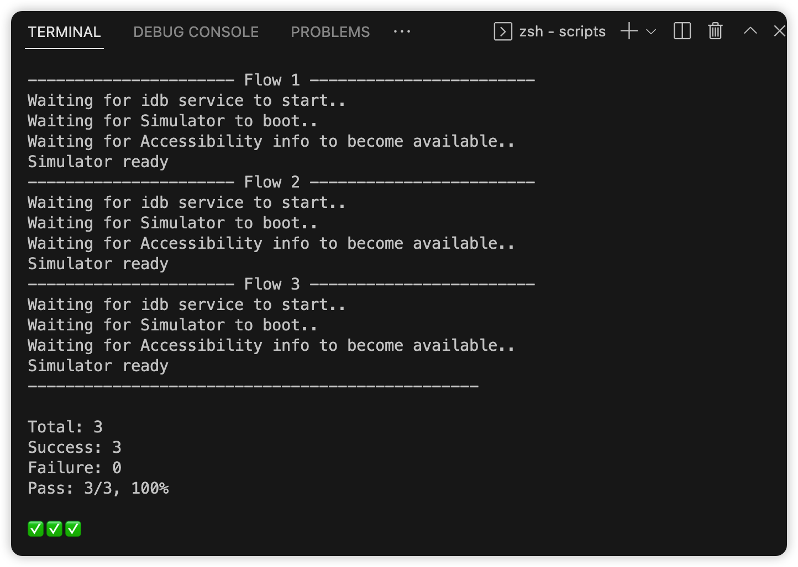
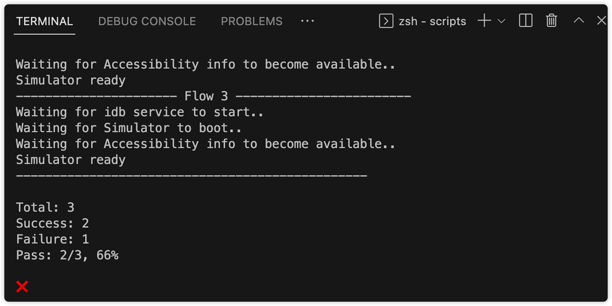

# maestro_e2e_test_example

 **Maestro** 是一個完整的測試框架，提供豐富的文件和API給開發者使用，其中的連續模式就很符合人性化，能夠有效幫助撰寫測試，而且讓非開發者也能參與，整體來說體驗很不錯，期待後續更新。

 本範例除了提供基本的測試範例，也有自己撰寫的 Script ，為了進行自動化多 `flow` 驗證，並提供結果報告，讓你能與CI整合

## Highlight
- UI 測試框架，使用 `yaml` 定義測試流程
- 容忍非同步和延遲，預設會自動等待操作完成
- 在連續模式下，能夠持續監控測試文件的變動，並在它們發生變化時重新運行，不需要再次編譯
- 主流 Mobile 平台都有支援，**Android、iOS、Flutter、React Native**

## Demo

## Weakness
當需要驗證多個 flow 測試時會無法正常完成，從第二個 flow 開始不會自動操作，例如：點擊按鈕、滾動等互動行為，必須手動操作畫面讓 `Maestro` 檢查，是個很不方便的過程。這邊我透過撰寫 Shell Script 來解決問題，逐一進行個別的 flow 驗證，可以查看 [./scripts/run_test.sh](./scripts/run_test.sh)，並在最後顯示驗證結果